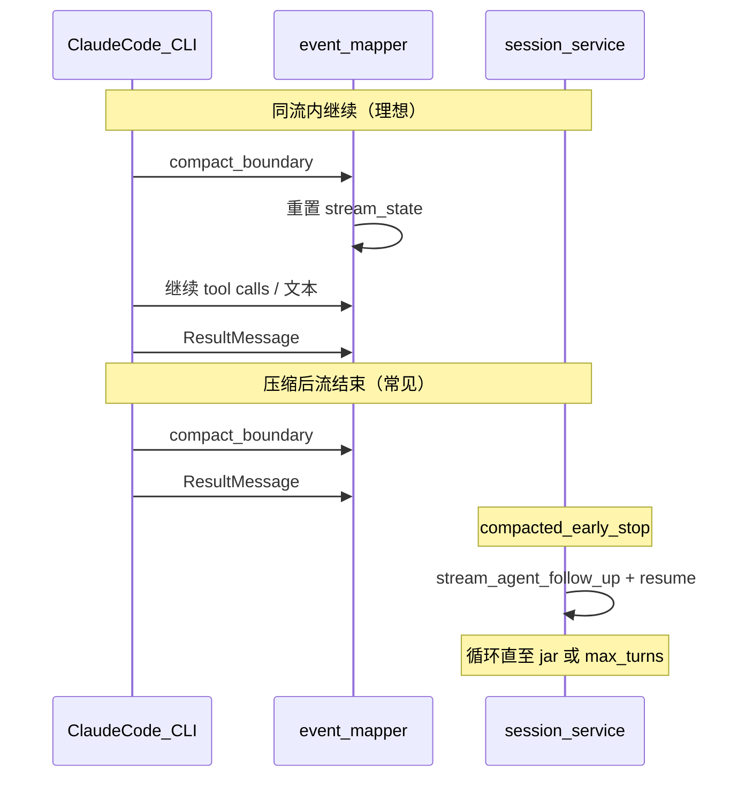

# Claude Agent SDK 集成说明

Moduscript 服务端通过 [Python Agent SDK](https://code.claude.com/docs/en/agent-sdk/python) 驱动真实编写流程。

## 架构

```
session_service.py
  └── AgentSession (agent/runner.py)
        └── ClaudeSDKClient
              cwd = data/workspaces/{user_id}/{session_id}/
              env   = admin/shared 或 user LLM 配置
```

## 选用 ClaudeSDKClient 的原因

| 能力 | query() | ClaudeSDKClient |
|------|---------|-----------------|
| 多轮 follow-up | 需手动 resume | 内置 |
| interrupt() | 不支持 | 支持 |
| AskUserQuestion | can_use_tool | can_use_tool |

## 事件映射

SDK 消息经 `agent/event_mapper.py` 转为前端 snapshot：

| SDK 消息 | 处理 |
|----------|------|
| `StreamEvent` text/thinking delta | 追加 `turns[].summary` / `thinking`；发出 SSE `patch` |
| `StreamEvent` `content_block_stop` / `message_stop` | 重置流式 `text`/`thinking` 标志，避免块边界后状态卡死 |
| `SystemMessage` `subtype=compact_boundary` | 重置流状态；标记本轮 `compacted`；发出 `compaction` side event |
| `AssistantMessage` `TextBlock` / `ToolUseBlock` | 非流式补全 summary；追加 `tools[]` |
| `AskUserQuestion`（经 `can_use_tool`） | `pending_action`（`ask_user` / `choice`） |
| `ResultMessage` | 写入 `agent_run` 与 `agent_cli_session_id`；触发 `agent.stream_end` 审计 |

单轮流消费由 `_consume_agent_stream()`（`session_service.py`）统一处理：`process_agent_message` → `_apply_side_events` → `_publish_patch`。

## Agent 轮次上限

- 环境变量 `CHAT_MAX_TURNS`，默认 **150**（服务端全局默认；主页高级设置可 per-session 覆盖，范围 10–500）
- 可在 `.env` 中覆盖全局默认，例如 `CHAT_MAX_TURNS=200`

## agent_run 诊断字段

每次 Agent 流结束后，snapshot 会包含 `agent_run`（并持久化到会话 JSON）：

| 字段 | 说明 |
|------|------|
| `started_at` / `ended_at` | 流开始/结束时间 |
| `num_turns` / `max_turns` | 实际轮次 / 配置上限 |
| `duration_ms` / `cost_usd` | CLI 报告的总耗时与费用 |
| `exit_reason` | 退出原因（见下表） |
| `artifact_found` | 结束时是否检测到 jar |
| `last_tool` | 最后一个工具名（如 `Bash`） |
| `compacted` | 当前轮是否因上下文压缩结束（每轮流开始前重置） |
| `auto_continuing` | 压缩后正在自动 resume 续写（`status=running` 时前端展示专用提示） |
| `compaction_count` | 本轮编写任务内自动续写次数 |

`exit_reason` 取值：

| 值 | 含义 |
|----|------|
| `completed_with_jar` | 正常结束且 jar 存在 |
| `completed_no_jar` | 正常结束但无 jar（未压缩或续写后仍无产物） |
| `compacted_early_stop` | 本轮流在压缩后早停（无 jar、未达轮次上限）；有 CLI session 时服务端会自动续写 |
| `max_turns_reached` | 达到 `CHAT_MAX_TURNS` 上限 |
| `stopped` | 用户停止或任务取消 |
| `exception` | CLI / bridge 异常 |
| `follow_up_done` | 用户手动跟进轮正常结束 |

排查时在 `data/logs/app.log` 搜索 `agent.stream_end` 或 `agent.compaction_auto_continue`，detail 中含完整诊断信息。

## 上下文压缩与自动续写

Claude Code 在上下文接近上限时会自动压缩历史，并在流中发出 `SystemMessage(subtype="compact_boundary")`（见 [Agent SDK 文档](https://code.claude.com/docs/en/agent-sdk/python)）。

### 两种结束方式



| 情况 | 服务端行为 |
|------|------------|
| 压缩后 **同一条流** 仍继续 | 仅修复事件映射；不介入 |
| 压缩后 **流结束** 且无 jar | `_run_agent` 内 `while` 循环：自动 `stream_agent_follow_up` + 续写提示，直到 jar 或 `max_turns_reached` |
| 无 `agent_cli_session_id` 无法 resume | 回退为 `status=completed` + 友好暂停提示，等用户手动跟进 |

续写提示常量：`AUTO_CONTINUE_AFTER_COMPACTION`（`session_service.py`），大意为「根据当前进度继续开发与编译，直至 `build/libs` 有 jar」。

每轮流开始前 `_merge_agent_run(compacted=False)`，仅当本轮 `stream_state.compacted` 为真时才判定 `compacted_early_stop`，避免续写轮无压缩时误触发无限循环。

审计事件：

| 事件 | 说明 |
|------|------|
| `agent.compaction_auto_continue` | 自动 resume 续写开始 |
| `agent.compacted_pause` | 无法 resume 时暂停等待用户 |

## CLI 会话恢复（resume）

Windows Proactor 模式下每轮流结束后会关闭 CLI 连接（`proactor_bridge` worker 内 `agent.close()`），**不能**依赖内存中的 `AgentSession.has_conversation` 跨轮记忆。

跨轮记忆依赖：

1. `ResultMessage.session_id` → 持久化到 `SessionRecord.agent_cli_session_id`（会话 JSON + 对话树 assistant 节点）
2. 下一轮 `_create_agent_session(..., cli_resume_id=record.agent_cli_session_id)`
3. `build_agent_options(resume=...)`；有 `resume` 时禁用 `continue_conversation`

适用场景：压缩自动续写、用户手动 `add_message` 跟进、分支切换后按节点恢复 CLI 上下文（见 [SESSION_BRANCH.md](SESSION_BRANCH.md)）。

**限制**：服务重启后本地 CLI session 可能失效，跟进会降级为新会话（与改前行为一致）。

## SSE 增量更新（patch）

Agent 运行期间，服务端默认发送轻量 `type: "patch"` 事件（300ms 防抖），而非每条 SDK 消息推送完整 snapshot：

- 文本/思考增量：`turn_patch.summary_append` / `turn_patch.thinking_append`
- 工具调用：`turn_patch.tool_added`
- 状态元数据：`status`、`stage_index`、`agent_run` 等

完整 snapshot 仍在连接建立、权限等待、任务结束等节点推送。环境变量：

| 变量 | 默认 | 说明 |
|------|------|------|
| `SSE_PUBLISH_DEBOUNCE_MS` | 300 | patch 防抖毫秒 |
| `SSE_STRIP_HEAVY_FIELDS` | true | SSE snapshot 省略 `final_prompt` / `readable_blueprint` / `payload` |

## agent_trace.jsonl

独立调试日志（默认 `data/logs/agent_trace.jsonl`），记录工具调用、消息增量、idle 告警等，不含完整 prompt。

| 变量 | 默认 | 说明 |
|------|------|------|
| `AGENT_TRACE_ENABLED` | true | 是否写入 trace |
| `AGENT_TRACE_LOG_DELTAS` | false | 是否记录每条 text/thinking delta |
| `AGENT_IDLE_WARN_SEC` | 120 | 运行中无更新时写入 `idle.warn` 的间隔（秒） |

## LLM 配置

优先级见 `storage/admin_store.py` 的 `resolve_llm_for_user()`：

1. `shared_llm_enabled=true` → `data/admin/llm_shared.json`
2. 否则 → `data/users/{id}/llm.json`

环境变量通过 `build_env()` 注入 Claude CLI 子进程。

## System Prompt 与语言

Agent 使用 Claude Code 默认 system prompt，并通过 `--append-system-prompt` 追加自定义片段（见 `agent/options.py`）：

- `build_mod_system_prompt()` — 当前硬编码「与用户沟通必须使用中文」
- `build_agent_options()` — `preset: claude_code` + `append: build_mod_system_prompt(mode)`

**TODO(i18n)：后续添加语言切换功能时，需同步修改：**

| 位置 | 说明 |
|------|------|
| `server/agent/options.py` → `build_mod_system_prompt()` | 按会话/用户 locale 生成 append 中的 `<language>` 与沟通规则 |
| `server/agent/options.py` → `build_agent_options()` | 若 locale 来自 payload，需传入并用于 append |
| `js/prompt-builder.js` → `buildProjectConstraintsXml()` | 用户提示词中的 `<global_language>` 需与 system append 一致 |

## 平台与模板

- 当前仅支持 **Fabric 1.20.1**（前后端均会规范化版本字段）
- 新建会话时若工作区无 `gradlew`，服务端尝试用 Playwright 从 fabricmc.net 下载模板（需 `playwright install chromium`）
- 可通过 `MOD_TEMPLATE_PAGE_TIMEOUT_MS` / `MOD_TEMPLATE_DOWNLOAD_TIMEOUT_MS` 调整页面与下载超时（默认 120000ms）
- Windows 上 Agent 在独立 Proactor 线程中运行（见 `agent/proactor_bridge.py`），请使用 `cd server && python main.py` 启动

## 工作区与 Git Checkpoint

每个编写会话的工作区为 `data/workspaces/{user_id}/{session_id}/`，Agent `cwd` 指向该目录。会话分支（重新输入 / 重新生成 / 切换版本）通过 Git commit 绑定节点与工作区状态，切换分支时对话即时更新、磁盘惰性同步。详见 [SESSION_BRANCH.md](SESSION_BRANCH.md)。

## 相关源码与测试

| 模块 | 路径 |
|------|------|
| 会话编排 | `server/session_service.py`（`_run_agent`、`_run_follow_up`、`_consume_agent_stream`） |
| 事件映射 | `server/agent/event_mapper.py` |
| Agent 封装 | `server/agent/runner.py`、`server/agent/options.py` |
| Windows 桥接 | `server/agent/proactor_bridge.py` |
| 编写页 UI | `js/session-preview.js`（`auto_continuing` / `compacted_early_stop` 提示） |
| 压缩与续写测试 | `server/test_event_mapper.py` |
| 诊断与 exit_reason | `server/test_agent_run_meta.py` |
| resume 选项 | `server/test_agent_options.py` |

## 故障排查

| 现象 | 处理 |
|------|------|
| 503 未配置 LLM | 管理后台或用户设置页填写 API |
| CLI not found | 安装 claude-agent-sdk 或设置 CLAUDE_CLI_PATH |
| `CLIConnectionError` / `NotImplementedError`（Windows） | 使用 `python main.py` 启动（`main.py` 会自动设置 Proactor 事件循环）；完全重启服务；或临时 `USE_MOCK_SESSIONS=true` |
| 会话 error | 查看 `agent_run` 与 `data/logs/app.log` 中 `agent.stream_end`；确认 API Key 与网络 |
| Agent 无 jar 就结束 | 看 `exit_reason`：`completed_no_jar` 为 Agent 自行结束；`compacted_early_stop` 为压缩早停（通常已自动续写）；`max_turns_reached` 为撞轮次上限 |
| 压缩后显示「编译未完成」 | 应已修复：压缩早停为 `completed` 暂停或自动续写，非 error；若仍出现查 `event_mapper` 是否处理 `compact_boundary` |
| 压缩后续写仍丢记忆 | 查 snapshot 是否含 `agent_cli_session_id`；跟进是否走 `resume`；服务是否重启导致 CLI session 失效 |
| 编写中提示「正在自动继续编写」 | `agent_run.auto_continuing=true`，压缩后自动 resume 中，属正常 |
| 页面长时间无更新 | 查 `agent_trace.jsonl` 是否仍有 `tool.use`；UI 静默提示会参考 `agent_run.last_tool` |
| SSE 流量过大 | 确认 `SSE_STRIP_HEAVY_FIELDS=true` 且前端处理 `patch` 事件 |
| SSE 连接中断 | 前端会自动重连并拉取 snapshot；服务端每 25s 发送 SSE ping |
| 工作区无 gradlew / bootstrap 失败 | 确认 `playwright install chromium`；查看 `data/logs/app.log` 与 `_bootstrap/mod_template_debug.json` |
| SSE 401 | 前端通过 `?token=` 传递 JWT（EventSource 无法带头） |
| 分支操作 501 / Git 失败 | 见 [SESSION_BRANCH.md](SESSION_BRANCH.md)；确认 `USE_MOCK_SESSIONS=false` 且系统已装 `git` |
