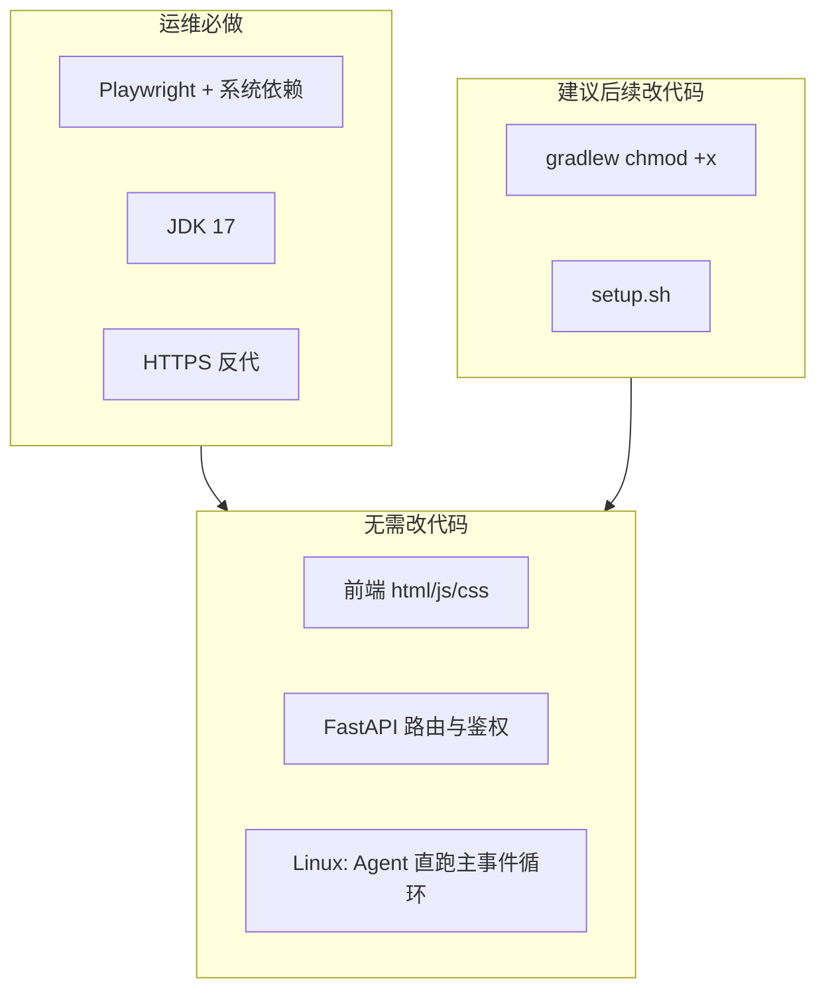

# Linux 迁移逐步检验

本文档用于将 MCmodAgent / Moduscript 从 Windows 开发环境迁移到 Linux 生产（或测试）服务器时，逐步核对每一项是否需要调整。

**结论摘要：** 服务端 Python 代码已按平台分支实现，Linux 上 Agent 路径比 Windows **更简单**（无需 Proactor 线程桥）。在正确安装系统依赖的前提下，**无需改业务代码即可跑通**；主要工作是运维配置与数据迁移注意事项。

**图例（结论列）：**

| 标记 | 含义 |
|------|------|
| 无需改 | 代码/模块可直接在 Linux 使用 |
| 运维配置 | 不改代码，需在服务器上安装或配置 |
| 建议改代码 | 非阻塞，但后续 PR 建议修复 |
| 必改代码 | 不修改则 Linux 无法正常工作（当前仓库 **无** 此类项） |

---

## 1. 迁移总览

| 检查项 | 结论 | 说明 | 验证方法 |
|--------|------|------|----------|
| Python 服务端跨平台 | 无需改 | [docs/DEPLOYMENT.md](DEPLOYMENT.md) 写明 Windows / Linux 均可 | 阅读 `server/` 中 `sys.platform` 分支 |
| Linux Agent 路径 | 无需改 | 非 Windows 时跳过 Proactor 桥，直接在 uvicorn 事件循环跑 Agent | 启动后建会话，观察 SSE 与 `data/logs/app.log` |
| 一键搭建脚本 | 运维配置 | 仅有 [scripts/setup.ps1](../scripts/setup.ps1)、[scripts/run.ps1](../scripts/run.ps1)，无 `setup.sh` | 按第 3 章手动命令或自建脚本 |
| Playwright + 系统库 | 运维配置 | Linux 除 `playwright install chromium` 外通常还需 `playwright install-deps` | bootstrap 阶段不报错 |
| OpenJDK 17+ | 运维配置 | `gradlew build` 依赖宿主机 Java | `java -version` |
| Claude CLI | 运维配置 | `claude-agent-sdk` Linux wheel 自带 bundled `claude` | 运行 [scripts/verify_cli.py](../scripts/verify_cli.py) |
| `USE_MOCK_SESSIONS` | 运维配置 | 生产必须为 `false` | `.env` 检查 |
| HTTPS / 反代 / systemd | 运维配置 | 见 [DEPLOYMENT.md](DEPLOYMENT.md) 生产建议 | 公网仅暴露 443 |



---

## 2. 无需调整的模块

以下模块在 Linux 上**无需修改代码**。每项附冒烟验证建议。

### 2.1 前端

| 检查项 | 结论 | 说明 | 验证方法 |
|--------|------|------|----------|
| `index.html`、`session.html` 等静态页 | 无需改 | 由 FastAPI 挂载项目根目录 | 浏览器打开 `/` |
| `js/config.js` API 地址 | 无需改 | `API.baseUrl: ''`，相对路径，与域名/OS 无关 | 同域访问 API 正常 |
| `platform` 配置项 | 无需改 | 指 MC 模组部署形态（客户端/服务端），非操作系统 | — |
| `navigator.clipboard` 等浏览器 API | 无需改 | 依赖用户浏览器，与服务端 OS 无关 | HTTPS 下复制功能正常 |

### 2.2 HTTP 与路由

| 检查项 | 结论 | 说明 | 验证方法 |
|--------|------|------|----------|
| `server/main.py` uvicorn | 无需改 | 绑定 `0.0.0.0:8000` | `curl http://127.0.0.1:8000/api/v1/site/settings` |
| 静态文件挂载 | 无需改 | `/` → 项目根，`/docs` → `docs/` | 访问 `/admin.html` |
| SSE 会话流 | 无需改 | 逻辑与 OS 无关；反代需关缓冲（运维） | 建会话后 EventSource 有事件 |
| CORS `allow_origins=["*"]` | 无需改 | 与 Linux 迁移无关；**生产安全**见 DEPLOYMENT | 同域部署无影响 |

### 2.3 鉴权与用户

| 检查项 | 结论 | 说明 | 验证方法 |
|--------|------|------|----------|
| `server/auth/` | 无需改 | JWT + bcrypt，纯 Python | 注册、登录、改密 |
| `server/user_routes.py` | 无需改 | — | 用户设置页读写 |
| `server/admin_routes.py` | 无需改 | 管理 API + 独立 panel 密码 | `/admin.html` 登录 |

### 2.4 存储

| 检查项 | 结论 | 说明 | 验证方法 |
|--------|------|------|----------|
| `server/storage/file_io.py` | 无需改 | `pathlib`，UTF-8 JSON | 读写 `data/users/` |
| `server/storage/user_store.py` | 无需改 | 用户/会话 JSON | 注册后文件出现 |
| `server/storage/admin_store.py` | 无需改 | LLM 配置、`build_env()` 注入 CLI 环境变量 | admin 保存 LLM |

### 2.5 会话与 Agent

| 检查项 | 结论 | 说明 | 验证方法 |
|--------|------|------|----------|
| `server/session_service.py` 工作区路径 | 无需改 | `data/workspaces/{owner_id}/{session_id}/` | 建会话后目录存在 |
| `server/agent/runner.py` | 无需改 | `ClaudeSDKClient`，`cwd` 为会话工作区 | Agent 能写文件 |
| `server/agent/event_mapper.py` | 无需改 | SDK 消息 → 前端 snapshot | 工作台显示 thinking/tools |
| `server/agent/proactor_bridge.py` | 无需改 | **Linux：`sys.platform != "win32"` 时直接 `send_prompt`，不启 worker 线程** | 会话无 `NotImplementedError` |
| `server/asyncio_platform.py` | 无需改 | Proactor 仅 `win32` 启用 | Linux 日志不会出现 ProactorEventLoop |
| `server/agent/options.py` CLI | 无需改 | bundled 二进制为 `claude`（非 `.exe`）；`verify_cli_async_transport` 在 Linux 直接返回成功 | verify_cli.py |
| `server/workspace_ops.py` 路径 | 无需改 | `rel_path.replace("\\", "/")` 兼容 Windows 风格路径 | 工作区浏览器列目录 |

### 2.6 其他服务端模块

| 检查项 | 结论 | 说明 | 验证方法 |
|--------|------|------|----------|
| `server/modrinth_client.py` | 无需改 | HTTP 客户端 | Modrinth URL 解析 |
| `server/mod_metadata*.py` | 无需改 | DeepSeek 元数据建议 | 自动填 mod 名 |
| `server/prompt_optimize.py` | 无需改 | — | 描述优化 API |
| `server/audit_log.py` | 无需改 | `data/logs/audit.jsonl` | 操作后日志有记录 |
| `server/session_mock.py` | 无需改 | `USE_MOCK_SESSIONS=true` 时启用；mock 工作区仅写 `gradlew.bat` 不影响 Linux 真实会话 | — |

### 2.7 测试

| 检查项 | 结论 | 说明 | 验证方法 |
|--------|------|------|----------|
| pytest 套件 | 无需改 | Linux 可运行 | `pytest test_auth.py test_http_utils.py -q` |
| 部分 fixture 仅用 `gradlew.bat` | 无需改 | 仅测试/Mock，非生产路径 | — |

---

## 3. 运维与配置（迁移必做）

以下为**非代码**步骤，迁移时必须逐项完成。可在部署时打印本表勾选。

### 3.1 系统依赖

| 检查项 | 结论 | 说明 | 验证方法 |
|--------|------|------|----------|
| Python 3.11+ | 运维配置 | Ubuntu 示例：`python3.11-venv` | `python3.11 -V` |
| 虚拟环境 | 运维配置 | 项目根 `.venv` | `test -x .venv/bin/python` |
| pip 依赖 | 运维配置 | `pip install -r server/requirements.txt` | verify_imports.py |
| OpenJDK 17+ | 运维配置 | Gradle 编译必需 | `java -version` 主版本 ≥ 17 |
| Playwright Chromium | 运维配置 | `playwright install chromium` | — |
| Playwright 系统库 | 运维配置 | **Linux 关键：** `playwright install-deps`（或手动 apt 装依赖） | bootstrap 不报错 |
| `pywin32` | 无需改 | 仅 Windows 随 `mcp` 安装；Linux 不会装 | — |

### 3.2 应用配置

| 检查项 | 结论 | 说明 | 验证方法 |
|--------|------|------|----------|
| 复制 `.env` | 运维配置 | 从 `.env.example`；勿提交 git | 文件存在 |
| `JWT_SECRET` | 运维配置 | 强随机字符串 | 非 placeholder |
| `MCMOD_BOOTSTRAP_ADMIN_EMAIL` | 运维配置 | 首注册管理员邮箱 | 注册后 role=admin |
| `MCMOD_ADMIN_PASSWORD` | 运维配置 | `/admin.html` 独立口令 | 能进管理后台 |
| `USE_MOCK_SESSIONS=false` | 运维配置 | 生产必须 false | `.env` |
| `MCMOD_DATA_DIR` | 运维配置 | 建议持久化盘绝对路径 | 目录可写 |

### 3.3 手动搭建命令（无 setup.sh 时）

```bash
# 以 Ubuntu/Debian 为例
sudo apt update
sudo apt install -y python3.11-venv openjdk-17-jdk

cd /opt/MCmodAgent   # 你的部署路径
python3.11 -m venv .venv
.venv/bin/pip install --upgrade pip
.venv/bin/pip install -r server/requirements.txt
.venv/bin/playwright install chromium
.venv/bin/playwright install-deps

cp .env.example .env
# 编辑 .env

cd server
../.venv/bin/python main.py
```

### 3.4 生产托管

| 检查项 | 结论 | 说明 | 验证方法 |
|--------|------|------|----------|
| systemd（或等价） | 运维配置 | WorkingDirectory=`.../server`，ExecStart=`.venv/bin/python main.py`，Restart=on-failure | `systemctl status mcmodagent` |
| 不暴露 8000 到公网 | 运维配置 | 仅本机或反代访问 | 外网扫 8000 不可达 |
| HTTPS 反代 | 运维配置 | Caddy / nginx | 浏览器锁图标 |
| SSE 反代设置 | 运维配置 | `proxy_buffering off`；`proxy_read_timeout` 足够长（如 3600s） | 长会话 SSE 不断 |
| 防火墙 | 运维配置 | 开放 443（及 22）；限制 admin | — |
| 备份 `data/` | 运维配置 | 含明文 API Key | 定期拷贝可恢复 |
| 限制 `/admin.html` | 运维配置 | IP 白名单或 VPN | 非授权 IP 403 |

### 3.5 systemd 示例

```ini
# /etc/systemd/system/mcmodagent.service
[Unit]
Description=MCmodAgent API
After=network.target

[Service]
Type=simple
User=mcmod
Group=mcmod
WorkingDirectory=/opt/MCmodAgent/server
EnvironmentFile=/opt/MCmodAgent/.env
ExecStart=/opt/MCmodAgent/.venv/bin/python main.py
Restart=on-failure
RestartSec=5

[Install]
WantedBy=multi-user.target
```

### 3.6 nginx SSE 片段示例

```nginx
location /api/ {
    proxy_pass http://127.0.0.1:8000;
    proxy_http_version 1.1;
    proxy_set_header Host $host;
    proxy_set_header X-Real-IP $remote_addr;
    proxy_buffering off;
    proxy_read_timeout 3600s;
}
```

### 3.7 冒烟顺序

- [ ] `GET /api/v1/site/settings` 返回 JSON
- [ ] 用 bootstrap 邮箱注册、登录
- [ ] `/admin.html` 配置 LLM API
- [ ] 首页「开始编写」创建会话
- [ ] 「创建环境」bootstrap 成功（工作区有 `gradlew`）
- [ ] Agent SSE 有 thinking / tools 输出
- [ ] 手动触发 build（若需 jar）
- [ ] 下载 artifact

### 3.8 环境校验脚本

```bash
cd server
../.venv/bin/python ../scripts/verify_imports.py
../.venv/bin/python ../scripts/verify_cli.py
../.venv/bin/python -m pytest test_auth.py test_http_utils.py -q
```

---

## 4. 平台相关代码行为差异

这些文件含 Windows 分支；Linux 行为不同但**通常无需修改**。迁移时勿误删分支。

| 检查项 | 结论 | Windows 行为 | Linux 行为 | 验证方法 |
|--------|------|-------------|-----------|----------|
| `server/asyncio_platform.py` | 无需改 | 设置 `WindowsProactorEventLoopPolicy` | 无操作 | 日志事件循环类型 |
| `server/agent/proactor_bridge.py` | 无需改 | 独立线程 + 队列桥接 uvicorn | 直接 `agent.send_prompt` | Agent 正常流式 |
| `server/main.py` L68–72 | 无需改 | SelectorEventLoop 打 error 日志 | 不触发 | — |
| `server/main.py` L770–771 | 无需改 | 强制 `reload=False` | 可按 `UVICORN_RELOAD` | — |
| `server/session_service.py` L1201–1202 | 无需改 | `_run_agent` finally **不**在主线程 `close()` agent | **会** `await agent.close()` | 会话结束无僵尸进程 |
| `server/session_service.py` L1257–1258 | 无需改 | shutdown 时同上 | Linux 会 close agent | 服务 stop 干净 |
| `server/workspace_ops.py` L53–62 | 无需改 | `gradlew.bat` + `shell=True` | `./gradlew` + `shell=False` | build API |
| `server/mod_bootstrap.py` L303–308 | 无需改 | 同上（`run_build=True` 时） | 同上 | — |
| `server/agent/options.py` L198–201 | 无需改 | `normcase` 路径回退 | 仅 `Path.relative_to` | 工作区 API 不 403 |
| `server/agent/options.py` L69–75 | 无需改 | npm `.cmd` → `claude.exe` | 不适用 | — |
| `server/agent/options.py` L104–105 | 无需改 | 校验 asyncio 子进程 | 直接返回 `(True, "")` | verify_cli.py |

---

## 5. 建议调整的代码

当前仓库**没有「必改代码」项**；以下为后续 PR 建议，按优先级排列。

### 5.1 `gradlew` 可执行权限（中优先级）

| 字段 | 内容 |
|------|------|
| 文件 | `server/mod_bootstrap.py`（约 L284–291，文件移动到 workspace 之后） |
| 结论 | 建议改代码 |
| 现状 | `zipfile.extractall` 后假定 `./gradlew` 可执行；Fabric zip 通常带 Unix 权限但不保证 |
| Linux 风险 | `Permission denied` / `[Errno 13]`；从 Windows 拷贝的 workspace 可能只有 `gradlew.bat` |
| 建议改法 | 非 Windows 时对 `(workspace / "gradlew")` 执行 `os.chmod(path, 0o755)` |
| 验证方法 | 新会话 bootstrap 后直接 `POST .../build` 成功 |

### 5.2 Gradle 调用方式（低优先级）

| 字段 | 内容 |
|------|------|
| 文件 | `server/workspace_ops.py` L53–62；`server/mod_bootstrap.py` L303–308 |
| 结论 | 建议改代码 |
| 现状 | `["./gradlew", "build", ...]` 依赖 cwd 与可执行位 |
| 建议改法 | 改为 `[str(workspace / "gradlew"), ...]`；或 fallback `["bash", str(workspace / "gradlew"), ...]` |
| 验证方法 | 与 5.1 相同 |

### 5.3 `is_under_workspace` 与符号链接（低优先级）

| 字段 | 内容 |
|------|------|
| 文件 | `server/agent/options.py` L192–202 |
| 结论 | 建议改代码（或运维约束） |
| 现状 | Linux 上 `resolve()` 后若路径经 symlink，`relative_to` 可能失败 |
| 建议 | 生产不对 `data/workspaces` 使用 symlink；或增加 `resolve()` 策略文档化 |
| 验证方法 | 工作区浏览不出现「invalid path」 |

### 5.4 生产相关但非 Linux 迁移项

| 检查项 | 结论 | 说明 |
|--------|------|------|
| `main.py` CORS `*` | 运维配置 / 后续代码 | 分域部署时需收紧；见 DEPLOYMENT |
| API Key 明文 JSON | 运维配置 | 备份与权限控制；非 OS 问题 |
| 无 rate limit | 后续代码 | 公网运营需单独规划 |

---

## 6. 文档与脚本待补

| 检查项 | 结论 | 现状 | 建议动作 | 验证方法 |
|--------|------|------|----------|----------|
| `scripts/setup.ps1` | 运维配置 | Windows 专用 | 新增 `scripts/setup.sh`（可选 PR）；本文第 3 章已给 bash 等价命令 | Linux 能一键搭建 |
| `scripts/run.ps1` | 运维配置 | Windows 专用 | 新增 `scripts/run.sh` 或仅用 systemd | 服务能启动 |
| `server/start.bat` | 无需改 | 调 run.ps1 | Linux 不使用 | — |
| `scripts/verify_*.py` | 无需改 | 跨平台；`verify_cli.py` 已注入 `server/` 到 `sys.path` | 第 3.8 节命令 |
| `docs/DEPLOYMENT.md` | 运维配置 | 偏 Windows 故障表（`gradlew.bat`） | 增补 Linux、`install-deps`、systemd | 文档可读 |
| `docs/AGENT_SDK.md` | 运维配置 | 强调 Windows Proactor | 补充「Linux 无需 Proactor 桥」 | — |
| `README.md` | 运维配置 | Windows 推荐 setup.ps1 | 增加 Linux 快速启动小节 | — |

---

## 7. 数据迁移检验（Windows → Linux）

从 Windows 拷贝 `data/` 时逐项核对。

| 检查项 | 结论 | 说明 | 验证方法 |
|--------|------|------|----------|
| `data/users/` | 无需改 | JSON 内为 UUID/邮箱，无 `D:\` 路径 | 登录原账号 |
| `data/admin/` | 无需改 | 站点设置、LLM Key 明文 | admin 面板配置仍在 |
| `data/workspaces/` | 运维配置 | 可拷贝；**仅有 `gradlew.bat` 无 `gradlew` 时 Linux build 失败** | 目录内存在可执行 `gradlew` |
| `gradlew` 执行权限 | 运维配置 | scp/rsync 可能丢失 `+x` | `chmod +x gradlew` 或重新 bootstrap |
| `gradlew` CRLF | 运维配置 | 少数情况脚本报错 | `dos2unix gradlew` |
| `.env` | 运维配置 | 单独拷贝，勿进 git | 服务读到正确变量 |
| `data/logs/` | 运维配置 | 可选不迁 | — |
| 停服再拷 | 运维配置 | 避免写入一半的文件 | 拷贝后文件完整 |

**建议：** 若工作区在 Windows 上从未成功 bootstrap，迁移后优先**新建会话**让 Linux 重新下载 Fabric 模板，而非强迁旧 workspace。

---

## 附录 A：平台相关文件索引

仓库内与 Windows / 平台相关的文件及分类（便于 Code Review）。

### A.1 Python 生产代码（9）

| 文件 | 分类 | 备注 |
|------|------|------|
| `server/asyncio_platform.py` | 无需改 | Proactor 仅 win32 |
| `server/agent/proactor_bridge.py` | 无需改 | Linux 走直连分支；每轮流结束 worker 内 `close()` |
| `server/agent/event_mapper.py` | 无需改 | `compact_boundary`、流边界重置 |
| `server/agent/options.py` | 无需改 | CLI 路径、`resume`、`is_under_workspace` |
| `server/agent/runner.py` | 无需改 | `cli_resume_id`、`AgentSession` |
| `server/workspace_ops.py` | 无需改 | gradlew 命令分支；5.2 可选增强 |
| `server/mod_bootstrap.py` | 建议改代码 | 5.1 chmod |
| `server/session_service.py` | 无需改 | `_run_agent` 压缩自动续写；agent.close 平台差异 |
| `server/main.py` | 无需改 | 启动告警、reload、CORS |

### A.2 脚本 / 运维（4）

| 文件 | 分类 | 备注 |
|------|------|------|
| `scripts/setup.ps1` | 运维配置 | Windows only |
| `scripts/run.ps1` | 运维配置 | Windows only |
| `server/start.bat` | 运维配置 | Windows only |
| `scripts/verify_cli.py` | 无需改 | 注释提 Windows；逻辑跨平台 |
| `scripts/verify_imports.py` | 无需改 | 跨平台 |

### A.3 文档（4）

| 文件 | 分类 | 备注 |
|------|------|------|
| `docs/DEPLOYMENT.md` | 运维配置 | 待增 Linux 章节 |
| `docs/AGENT_SDK.md` | 运维配置 | 待增 Linux 说明 |
| `README.md` | 运维配置 | 待增 Linux 快速启动 |
| `docs/LINUX_MIGRATION.md` | — | 本文档 |

### A.4 测试 / Mock（5）

| 文件 | 分类 | 备注 |
|------|------|------|
| `server/session_mock.py` | 无需改 | mock 仅 `gradlew.bat` |
| `server/test_mod_bootstrap.py` | 无需改 | 测试 zip 含 bat |
| `server/test_stage_transitions.py` | 无需改 | fixture 写 bat |
| `server/test_event_mapper.py` | 无需改 | 压缩边界、自动续写、resume |
| `server/test_agent_run_meta.py` | 无需改 | `exit_reason`、`agent_run` 诊断 |

### A.5 前端

| 范围 | 分类 | 备注 |
|------|------|------|
| `*.html`、`js/`、`css/` | 无需改 | 无 OS 相关代码 |

---

## 附录 B：迁移后完整验证命令

```bash
# 1. 依赖与 CLI
cd /opt/MCmodAgent/server
../.venv/bin/python ../scripts/verify_imports.py
../.venv/bin/python ../scripts/verify_cli.py

# 2. 单元测试
../.venv/bin/python -m pytest test_auth.py test_http_utils.py test_event_mapper.py test_agent_run_meta.py -q

# 3. HTTP 冒烟
curl -sS http://127.0.0.1:8000/api/v1/site/settings | head

# 4. Java（若需编译）
java -version

# 5. 手工：浏览器注册 → 建会话 → 观察 SSE → build → 下载 jar
```

---

## 附录 C：不在本文档范围

- 实现 `setup.sh` / 提交 systemd unit 到仓库（可另开任务）
- 生产安全加固：rate limit、API Key 加密、CORS 收紧
- Docker / Kubernetes 部署
- 自动测试 MC 服务器（见 [TEST_SERVER.md](TEST_SERVER.md)）

---

## 相关文档

- [DEPLOYMENT.md](DEPLOYMENT.md) — 通用部署与生产建议
- [AGENT_SDK.md](AGENT_SDK.md) — Claude Agent SDK 集成、上下文压缩、resume
- [PLAN_MODE.md](PLAN_MODE.md) — 规划模式与 handoff
- [SESSION_BRANCH.md](SESSION_BRANCH.md) — 会话分支与 Git checkpoint
- [CLOSED_BETA.md](CLOSED_BETA.md) — 封闭测试协议
