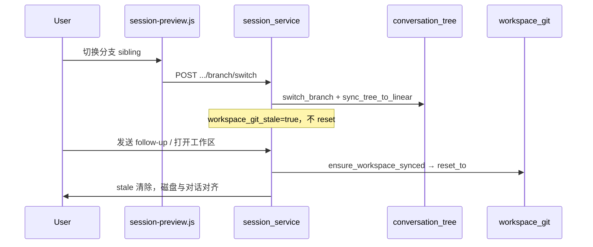

# 编写会话分支与 Git 工作区同步

编写页（`session.html`）支持 DeepSeek 风格的**对话分支**：重新输入、重新生成、分支切换，并与工作区 Git checkpoint 联动，保证回溯后磁盘代码与当前对话一致。

> **Mock 模式**：`USE_MOCK_SESSIONS=true` 时不初始化 Git、不执行 reset/checkpoint，分支 API 返回 501。

## 用户可见功能

| 操作 | 入口 | 行为 |
|------|------|------|
| **重新输入** | 用户消息「编辑」 | 修改该条用户消息后 fork 新分支，从该轮重新跑 Agent |
| **重新生成** | 最新 assistant「重新生成」 | 丢弃当前 assistant 回复，fork 新 sibling，在同一 user 消息下重跑 |
| **分支切换** | 消息旁 `‹ 1/2 ›` 导航 | 切换 sibling 版本；对话立即更新，工作区**惰性**同步（见下文） |
| **首条任务稿编辑** | 根 user 消息「编辑」 | 确认后清空工作区、重建 Git、重新 bootstrap |

限制（后端 `_assert_branch_allowed`）：

- Agent 运行中、有待回复权限、或 `branch_processing` 时不可操作
- 管理员代发消息（`sent_by_admin`）不可编辑

## 架构概览

```
conversation_tree（持久化在会话 JSON）
  ├── nodes: { node_id → user | assistant 节点 }
  ├── active_path: 当前视图路径
  ├── root_sibling_ids: 首条任务稿多版本
  └── 每节点 active_child_id: 切换分支时恢复下游 path

workspace_git（data/workspaces/{user_id}/{session_id}/）
  ├── init_repo / checkpoint / reset_to / reinit_repo
  └── 节点 git_ref / git_ref_start 指向 commit SHA
```



## 对话树数据模型

模块：[`server/conversation_tree.py`](../server/conversation_tree.py)

### 节点字段

| 字段 | 适用 | 说明 |
|------|------|------|
| `type` | 全部 | `user` / `assistant` |
| `kind` | user | `initial` / `follow_up` |
| `content` | user | 消息正文 |
| `turn_snapshot` | assistant | 完整 turn（summary、tools、thinking、progress） |
| `git_ref` | 全部 | 该节点代表的工作区 commit（user=发送后，assistant=完成后） |
| `git_ref_start` | assistant | Agent 启动前基线（regenerate 重置目标） |
| `agent_cli_session_id` | assistant | Claude CLI resume id |
| `active_child_id` | 有子节点 | 当前选中的下游分支，切换回来时恢复 path |
| `children` | 全部 | 子节点 id 列表 |

### 线性字段迁移

旧会话仅有 `turns` / `user_messages` 时，`ensure_tree()` 调用 `migrate_linear_to_tree()` 一次性迁移。加载时 `backfill_active_children()` 回填 `active_child_id`，`backfill_git_refs_from_workspace()` 用当前 HEAD  best-effort 补全缺失 `git_ref`。

## Git Checkpoint 策略

模块：[`server/workspace_git.py`](../server/workspace_git.py)

| 时机 | 写入节点 | commit message 示例 |
|------|----------|---------------------|
| Fabric bootstrap 完成 | root user | `Fabric bootstrap` |
| follow-up 发送后、Agent 启动前 | user follow-up | `pre-run user msg` |
| 新 assistant turn 创建后、Agent 启动前 | assistant | `pre-run assistant`（`git_ref_start`） |
| build / follow-up 完成 | assistant | `build complete` / `follow-up complete`（`git_ref`） |

辅助函数：

- `git_ref_for_path_leaf(tree)` — 从 `active_path` 叶向上找最近 `git_ref`（切换/同步目标）
- `git_ref_for_reset_before(tree, node_id)` — regenerate/rewind 重置点（优先 `git_ref_start`）

`reset_to` 行为：

- `git reset --hard` + `git clean -fd`，**保留** `references/`（参考 mod 目录）
- 无效 ref 或空 ref 时抛 `WorkspaceGitError`（不再静默跳过）

首条任务稿重输入：wipe 工作区内容后 `reinit_repo()`，不保留脏 Git 历史。

## 惰性工作区同步

切换分支时**不立即** `git reset`，避免频繁切换卡顿。

| 操作 | 是否立即 reset 工作区 |
|------|----------------------|
| 切换分支（仅浏览对话） | **否** |
| 发送 follow-up / regenerate / rewind | **是**（运行前 `ensure_workspace_synced`） |
| 打开工作区浏览器 / 下载 jar / gradlew build | **是**（API 入口 `_ensure_workspace_synced_sync`） |

### Snapshot 字段

| 字段 | 说明 |
|------|------|
| `workspace_git_stale` | 磁盘 HEAD 与当前分支期望 ref 不一致 |
| `workspace_git_expected_ref` | 当前 path 应对齐的 commit |
| `workspace_git_warning` | 缺 ref 或 reset 失败时的警告文案 |

`workspace_git_stale=true` 时，`artifact_ready` **不读磁盘** jar，改从已持久化的 `delivery.artifact_name` 推导（若该分支曾完成）；`artifact_ready` 时顶栏「下载 jar」保持可点，点击后由 `/build` 入口触发 `_ensure_workspace_synced_sync` 同步工作区再打包。

## HTTP API

| 方法 | 路径 | Body | 说明 |
|------|------|------|------|
| `POST` | `/api/v1/sessions/{id}/regenerate` | — | 重新生成最新 assistant |
| `POST` | `/api/v1/sessions/{id}/rewind` | `{ "node_id", "new_content"? }` | 编辑 user 节点并 fork |
| `POST` | `/api/v1/sessions/{id}/branch/switch` | `{ "node_id" }` | 切换到指定 sibling 及其 `active_child_id` 下游 |

均返回完整 `snapshot`。Mock 模式返回 501。

前端封装：[`js/session-api.js`](../js/session-api.js) — `regenerateSession` / `rewindSession` / `switchSessionBranch`。

## 前端实现

模块：[`js/session-preview.js`](../js/session-preview.js)

### 渲染

- 有 `conversation_tree` 时按 `active_path` 渲染，不再仅用线性 `turns`
- **增量更新**：path 不变且末节点为 assistant 时，只更新该 turn DOM（`updateAssistantTurnNode`），避免 Agent 流式工具调用时滚动条跳动
- `turnContentFingerprint` 检测 tools/thinking 数量变化，支持同 path 内容增量
- `mirrorTurnToConversationTree` 使用 `structuredClone` 深拷贝 turn，避免嵌套数组共享引用

### 分支操作后

- `applyBranchSnapshot`：`messagesHasRendered = false` 后 `applySnapshot`，强制全量重渲染，避免 DOM 与 path 不同步
- `workspace_git_warning` 仍 toast 提示；**不**对 `workspace_git_stale` 弹切换提示（避免打扰）
- stale 时顶栏「下载 jar」在 `artifact_ready` 时仍可点击（会先 sync 再 build）；打开项目文件夹时后端 listing 会自动 sync

样式：[`css/styles.css`](../css/styles.css) — `.session-msg-actions`、`.session-branch-nav` 等。

## 分支切换状态同步

`switch_branch` 除更新树外还会：

- `sync_tree_to_linear` — 刷新 `turns` / `user_messages` / `final_prompt`；**始终**写入 `agent_cli_session_id`（含 `None`，避免切到无 CLI id 分支仍用旧 resume id）
- `_sync_status_from_active_path` — 从叶节点 `turn_snapshot.progress` 推导 `status` / `interaction_kind`
- 清空 `agent_run` / `error_message`
- `_mark_workspace_git_after_switch` — 标记 stale，不 reset

`regenerate` / `rewind`：先 `persist`，再 `ensure_workspace_synced`，再按 `git_ref_for_reset_before` 重置；缺 checkpoint 时 **400 抛错**。

## 关键源文件

| 文件 | 职责 |
|------|------|
| [`server/conversation_tree.py`](../server/conversation_tree.py) | 树模型、fork、switch、`branch_meta` |
| [`server/workspace_git.py`](../server/workspace_git.py) | Git init/checkpoint/reset/reinit |
| [`server/session_service.py`](../server/session_service.py) | 分支 API、checkpoint 挂载、ensure sync |
| [`server/main.py`](../server/main.py) | 路由注册 |
| [`js/session-preview.js`](../js/session-preview.js) | 分支 UI、增量渲染 |
| [`js/session-api.js`](../js/session-api.js) | API 客户端 |

## 测试

```bash
cd server
pytest test_session_branch.py test_session_branch_integration.py test_workspace_git.py test_session_reference.py -v
```

| 测试文件 | 覆盖 |
|----------|------|
| `test_session_branch.py` | 树 fork/switch、`git_ref_*` helper、`sync_tree_to_linear` 清 CLI id |
| `test_session_branch_integration.py` | 真实 Git + 文件内容：regenerate、惰性 switch + ensure、descendant path |
| `test_workspace_git.py` | init/checkpoint/reset、`reinit_repo`、`verify_ref`、references 保留 |

## 故障排查

| 现象 | 处理 |
|------|------|
| 切换分支后对话变了、文件还是旧的 | 预期行为（stale）；发送消息或打开工作区后会 sync |
| toast「此分支缺少工作区快照」 | 旧会话或未 checkpoint 的节点；best-effort 回填后仍可能缺 ref |
| 「无法回滚工作区：缺少 git checkpoint」 | regenerate/rewind 前无 `git_ref`/`git_ref_start` |
| 切换上级再切回，新消息消失 | 检查 `active_child_id` 是否写入；见 `commit_active_path` |
| Agent 流式时页面卡顿/滚动跳顶 | 确认前端走 path 增量更新而非每次 `innerHTML=''` |
| 分支 API 501 | `USE_MOCK_SESSIONS=true`，需真实 Agent 模式 |
| Git 命令失败 | 确认系统已安装 `git`；查 `data/logs/app.log` 中 `session.workspace_git_*` 审计 |

## 与 Agent SDK 的关系

工作区路径即 Agent `cwd`（见 [AGENT_SDK.md](AGENT_SDK.md)）。分支 checkpoint 保证 regenerate/rewind 后 Agent 在正确代码基线上运行；`agent_cli_session_id` 按分支节点存储，切换分支时会同步到 `SessionRecord` 供 `_create_agent_session` 使用。

### 与上下文压缩 / resume 的交互

| 场景 | 行为 |
|------|------|
| 编写中触发自动压缩续写 | 使用当前分支叶节点上的 `agent_cli_session_id` 做 `resume`；`agent_run.auto_continuing` 在前端显示「正在自动继续编写」 |
| 切换分支 | `sync_tree_to_linear` **始终**写入 `agent_cli_session_id`（含 `None`），避免切到无 CLI id 的分支仍用旧 resume |
| regenerate / rewind | 新 assistant 节点从空 CLI id 开始；完成后写入新的 `ResultMessage.session_id` |
| 服务重启 | CLI 本地 session 可能失效，resume 降级为新会话（与单线编写相同） |

压缩与自动续写细节见 [AGENT_SDK.md — 上下文压缩与自动续写](AGENT_SDK.md#上下文压缩与自动续写)。
